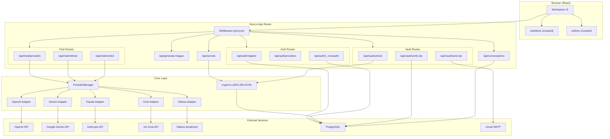
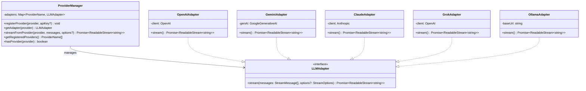
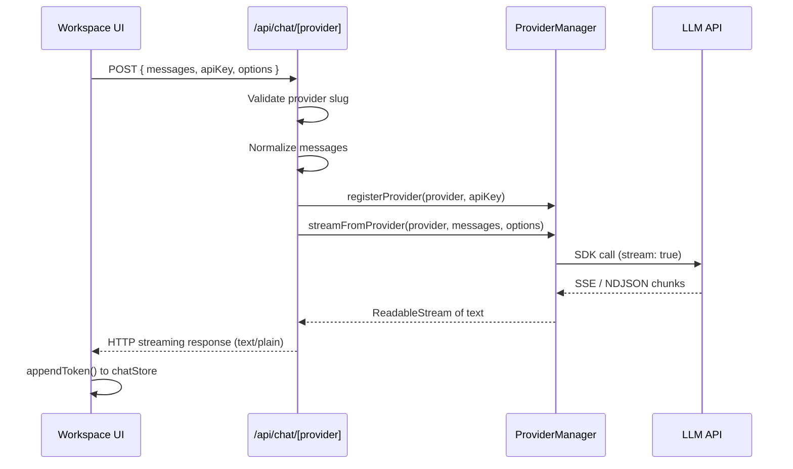
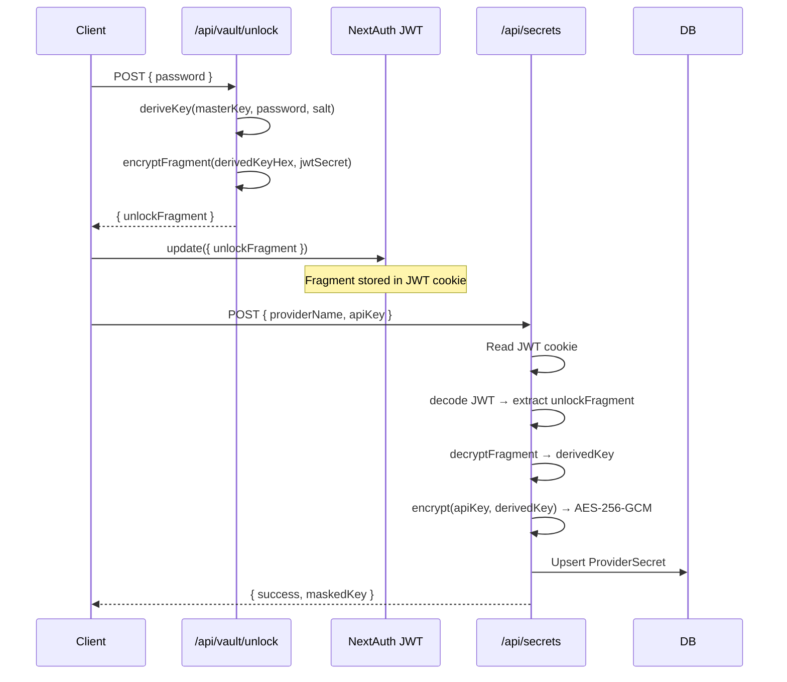
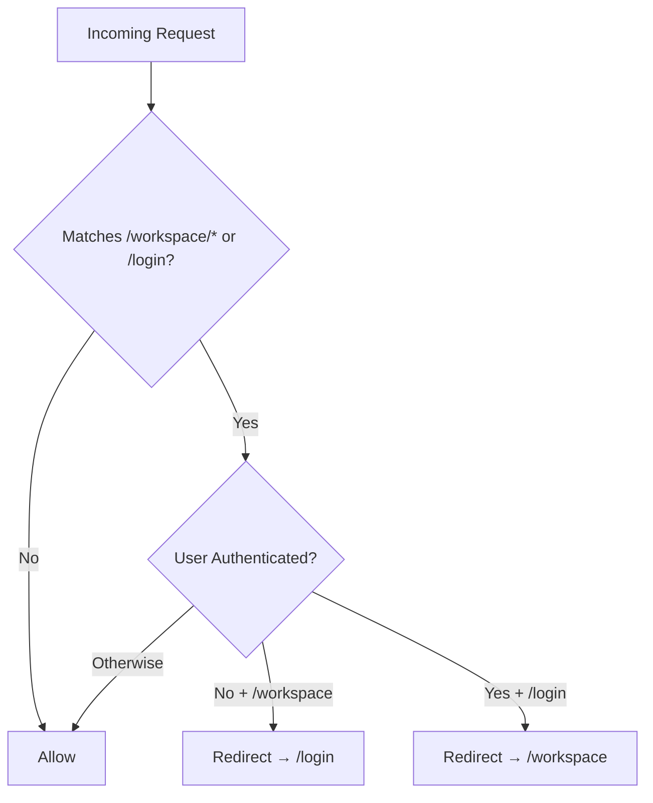

# Backend Architecture — Plot

> **Framework:** Next.js 16 (App Router) · **Runtime:** Node.js · **ORM:** Prisma 5 · **Auth:** NextAuth v5 (JWT)

---

## System Architecture Overview



---

## Core Layer: Strategy Pattern for LLM Providers

The LLM streaming architecture uses the **Strategy Pattern** — each provider implements the `LLMAdapter` interface and is dynamically instantiated by `ProviderManager`.



### Adapter Details

| Adapter | SDK / Protocol | Default Model | System Message Handling |
|---|---|---|---|
| `OpenAIAdapter` | `openai` SDK | `gpt-4o-mini` | Inline in messages array |
| `GeminiAdapter` | `@google/generative-ai` | `gemini-2.5-flash` (with fallback chain) | Extracted as `systemInstruction` param |
| `ClaudeAdapter` | `@anthropic-ai/sdk` | `claude-sonnet-4-20250514` | Extracted as top-level `system` param |
| `GrokAdapter` | `openai` SDK (custom `baseURL`) | `grok-2-latest` | Inline in messages array |
| `OllamaAdapter` | Raw `fetch` (NDJSON) | `llama3.2` | Inline in messages array |

**Error handling:** Every adapter wraps vendor errors in user-friendly messages injected into the stream (never throws raw exceptions). Connection errors (401, 429, 402) have specific error messages.

**Gemini fallback chain:** If the requested model is unavailable, Gemini tries the full chain: `gemini-2.5-flash → gemini-2.5-flash-lite → gemini-2.5-pro → gemini-2.0-flash → gemini-2.0-flash-lite → gemini-1.5-flash → gemini-1.5-pro`.

---

## API Routes

### Authentication

| Route | Method | Purpose |
|---|---|---|
| `/api/auth/[...nextauth]` | GET, POST | NextAuth v5 handler — delegates to `lib/auth.ts` |
| `/api/auth/register` | POST | User registration — bcrypt hash, PBKDF2 salt generation |
| `/api/auth/providers` | GET | Returns which OAuth providers are configured (Google) |

**Registration flow:** Validates email/password → checks uniqueness → bcrypt hash (12 rounds) → generates PBKDF2 salt → creates `User` record.

---

### Chat Streaming



| Route | Method | Purpose |
|---|---|---|
| `/api/chat/[provider]` | POST | Isolated streaming — one provider per request, one HTTP stream |
| `/api/chat/referee` | POST | Non-streaming — collects all responses, generates comparison summary via chosen provider |
| `/api/chat/verdict` | POST | Streaming — similar to referee but returns streaming text for real-time display |

**Referee vs Verdict:**
- **Referee** (`/api/chat/referee`): Reads responses from request body or fetches from DB by `batchId`. Returns **JSON** with `{ summary, refereeProvider, persisted }`. Persists summary to database.
- **Verdict** (`/api/chat/verdict`): Takes responses in request body. Returns **streaming text** for real-time display in `VerdictCard`. Does not persist to database.

---

### Vault & Secrets Management



| Route | Method | Purpose |
|---|---|---|
| `/api/vault/unlock` | POST | PBKDF2 key derivation + encrypt fragment into JWT |
| `/api/vault/send-otp` | POST | Generate OTP, store HMAC hash, email via nodemailer |
| `/api/vault/verify-otp` | POST | Timing-safe OTP verification with attempt limiting |
| `/api/secrets` | GET | List provider names with masked keys |
| `/api/secrets` | POST | Encrypt and store API key (requires unlocked vault) |
| `/api/secrets` | DELETE | Remove stored API key |

**Vault unlock lifecycle:**
1. User enters vault password → server derives key via PBKDF2 + HMAC
2. Derived key hex is encrypted using `NEXTAUTH_SECRET` → `unlockFragment`
3. Fragment stored in JWT cookie via `session.update()`
4. Fragment auto-expires after **30 minutes** (sliding expiration in JWT callback)

---

### Conversations & Image Generation

| Route | Method | Purpose |
|---|---|---|
| `/api/conversations` | GET | List user's conversations (latest 50) |
| `/api/conversations` | POST | Create new conversation with title |
| `/api/conversations` | DELETE | Clear all user conversations |
| `/api/conversations/[id]` | DELETE | Delete specific conversation |
| `/api/generate-images` | POST | Fan-out image generation via OpenAI/Grok, streamed as NDJSON |

**Image fan-out:** All requested providers run concurrently via `Promise.allSettled()`. Progress is streamed as NDJSON events: `provider-start` → `image` (with base64 data URL) → `provider-done` → final `done`.

---

## Authentication & Middleware

### NextAuth v5 Configuration (`lib/auth.ts`)

- **Providers:** Credentials (email/password) + Google OAuth (conditional)
- **Strategy:** JWT (24-hour expiry)
- **Adapter:** PrismaAdapter (handles OAuth user creation)
- **Custom callbacks:**
  - `signIn` — blocks failed credential attempts, allows all OAuth
  - `redirect` — always redirects to `/workspace` after sign-in
  - `jwt` — attaches `userId`, handles vault unlock fragment with sliding expiration
  - `session` — exposes `user.id` and `isUnlocked` to client
  - `authorized` — middleware gate for route protection

### Route Protection (`proxy.ts`)



---

## Cryptographic Security (`core/security/crypto.ts`)

| Function | Purpose |
|---|---|
| `deriveKey(masterKeyHex, userPassword, saltBase64)` | PBKDF2 (100k rounds, SHA-512) + HMAC-SHA256 → 32-byte AES key |
| `encrypt(plaintext, derivedKey)` | AES-256-GCM with random 12-byte IV → `{ cipherText, iv, authTag }` |
| `decrypt(payload, derivedKey)` | AES-256-GCM decryption with auth tag validation |
| `generateSalt()` | 32-byte cryptographic random salt (Base64) |
| `maskSecret(secret)` | Display-safe masking: `"sk-abc...Z789"` → `"sk-••••••••Z789"` |
| `encryptFragment(derivedKeyHex, jwtSecret)` | Pack IV + authTag + ciphertext into single Base64 string for JWT |
| `decryptFragment(packed, jwtSecret)` | Unpack and decrypt fragment from JWT |

---

## File Tree (Backend)

```
src/
├── app/api/
│   ├── auth/
│   │   ├── [...nextauth]/route.ts    # NextAuth handler
│   │   ├── providers/route.ts         # Available auth providers
│   │   └── register/route.ts          # User registration
│   ├── chat/
│   │   ├── [provider]/route.ts        # Per-provider streaming
│   │   ├── referee/route.ts           # Multi-model comparison
│   │   └── verdict/route.ts           # Streaming verdict
│   ├── conversations/
│   │   ├── route.ts                   # CRUD (list, create, clear)
│   │   └── [id]/route.ts             # Delete specific
│   ├── generate-images/route.ts       # Image fan-out (NDJSON)
│   ├── secrets/route.ts               # Encrypted API key management
│   └── vault/
│       ├── send-otp/route.ts          # OTP generation + email
│       ├── verify-otp/route.ts        # OTP verification
│       └── unlock/route.ts            # Vault unlock (key derivation)
├── core/
│   ├── providers/
│   │   ├── types.ts                   # LLMAdapter interface + types
│   │   ├── manager.ts                 # ProviderManager (Strategy)
│   │   ├── openai-adapter.ts
│   │   ├── gemini-adapter.ts
│   │   ├── claude-adapter.ts
│   │   ├── grok-adapter.ts
│   │   └── ollama-adapter.ts
│   └── security/
│       └── crypto.ts                  # AES-256-GCM vault
├── lib/
│   ├── auth.ts                        # NextAuth v5 config
│   └── prisma.ts                      # Prisma singleton
├── proxy.ts                           # Auth middleware
└── types/
    └── next-auth.d.ts                 # JWT/Session type augmentation
```
