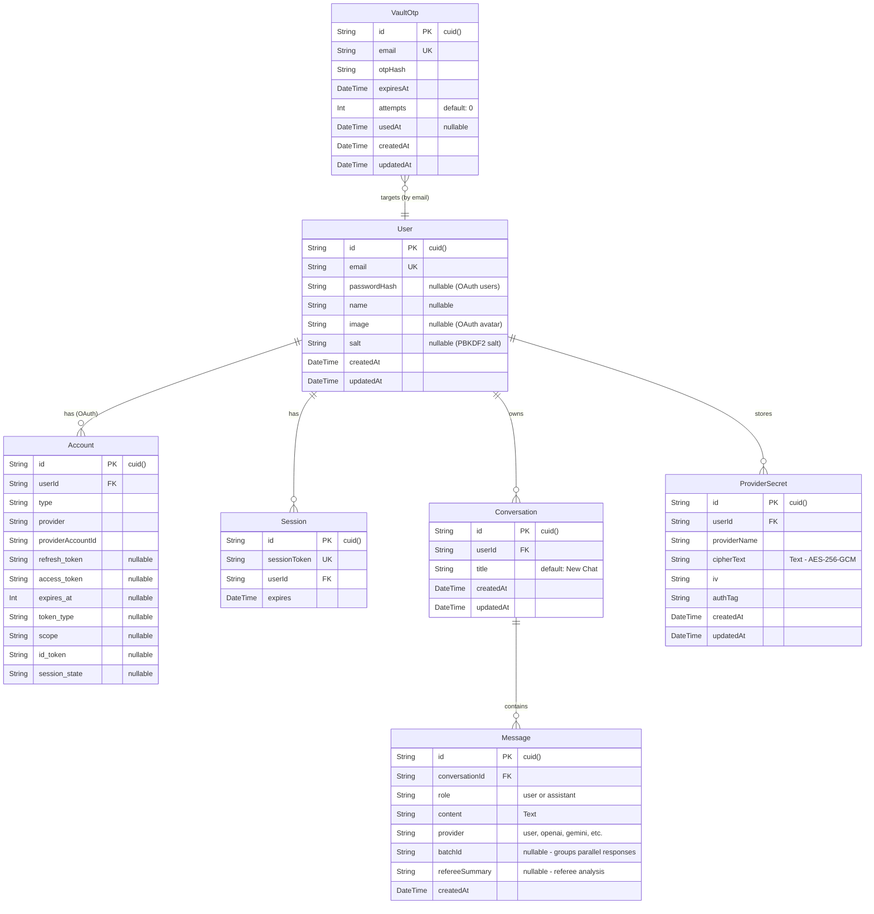
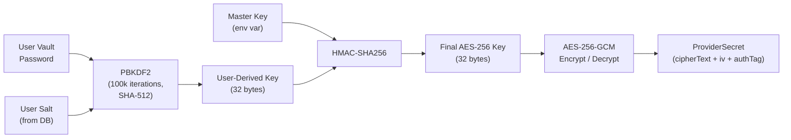
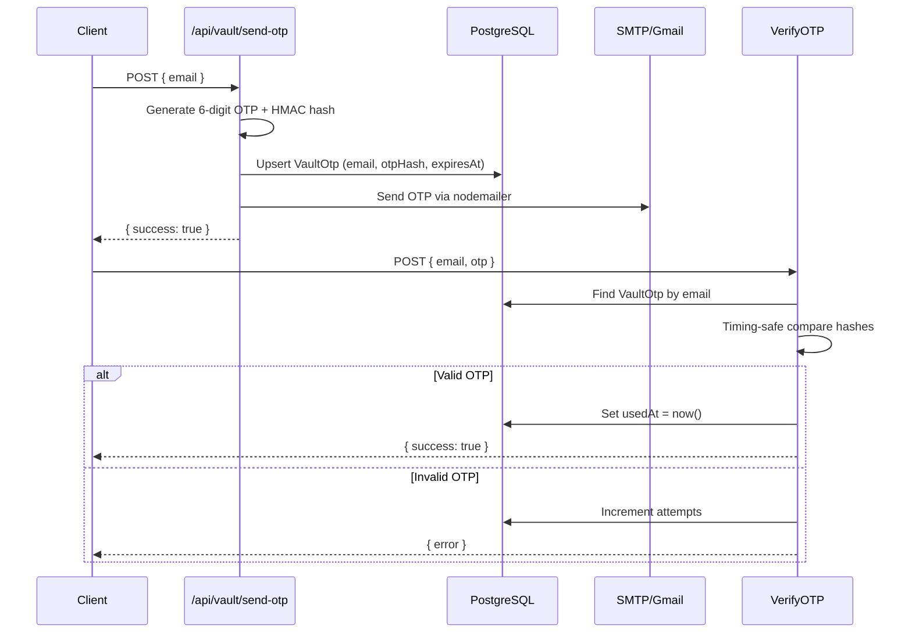

# Database Schema — Plot

> **ORM:** Prisma 5 · **Provider:** PostgreSQL · **Schema file:** `prisma/schema.prisma`

---

## Entity-Relationship Diagram

---

## Models in Detail

### 1. `User`

Central identity model supporting **both** credentials and OAuth login.

| Field | Purpose |
|---|---|
| `passwordHash` | bcrypt hash — `null` for OAuth-only users |
| `salt` | Base64-encoded 32-byte random salt for PBKDF2 vault key derivation, generated at registration via `generateSalt()` |
| `image` | Profile avatar URL (populated by OAuth providers) |

**Relations:** Cascades delete to `Account`, `Session`, `Conversation`, and `ProviderSecret`.

---

### 2. `Account` (NextAuth OAuth)

Stores OAuth tokens for external providers (Google, GitHub, etc.).

- **Unique constraint:** `(provider, providerAccountId)` — one account per OAuth identity.
- `access_token`, `refresh_token`, `id_token` stored as `@db.Text` to handle large JWT payloads.

---

### 3. `Session` (NextAuth)

Server-side session records. Although Plot uses **JWT strategy** (`strategy: "jwt"` in `auth.ts`), NextAuth still creates session records when the Prisma adapter is active.

---

### 4. `Conversation`

A chat thread owned by a user. Ordered by `updatedAt` descending in the sidebar.

- `title` defaults to `"New Chat"` and is updated to the first prompt text (truncated to 120 chars).
- **Cascade delete:** Removing a conversation deletes all its messages.

---

### 5. `Message`

Individual messages within a conversation.

| Field | Purpose |
|---|---|
| `role` | `"user"` or `"assistant"` |
| `provider` | Identifies the source: `"user"`, `"openai"`, `"gemini"`, `"claude"`, `"grok"`, `"ollama"`, `"referee"`, or `"verdict"` |
| `batchId` | Groups all assistant messages that were generated from the **same user prompt** (parallel fan-out). Enables referee to find the related set of responses. |
| `refereeSummary` | Stores the referee analysis text on each assistant message in the batch |

**Indexes:** `conversationId`, `batchId` — for efficient batch and conversation lookups.

---

### 6. `ProviderSecret`

Encrypted API keys stored at rest using **AES-256-GCM**.

| Field | Purpose |
|---|---|
| `cipherText` | Base64-encoded encrypted API key |
| `iv` | 12-byte initialization vector (unique per encryption) |
| `authTag` | 16-byte GCM authentication tag |
| `providerName` | `"openai"`, `"gemini"`, `"claude"`, `"grok"` |

**Unique constraint:** `(userId, providerName)` — one key per provider per user.

---

### 7. `VaultOtp`

Temporary OTP records for vault password reset.

| Field | Purpose |
|---|---|
| `email` | Unique — one pending OTP per email |
| `otpHash` | HMAC-SHA256 hash of `email:otp` using `OTP_SECRET` |
| `expiresAt` | 5-minute TTL from creation |
| `attempts` | Tracks failed verification attempts (max 5) |
| `usedAt` | Set to current time on successful verification, preventing reuse |

**Index:** `expiresAt` — for efficient cleanup of expired records.

---

## Key Derivation & Encryption Flow

> **Two-part derivation** ensures neither a server compromise (leaking `SECRET_MASTER_KEY`) nor a database dump alone is sufficient to decrypt stored API keys — the attacker always needs the user's vault password.

---

## OTP Verification Flow

