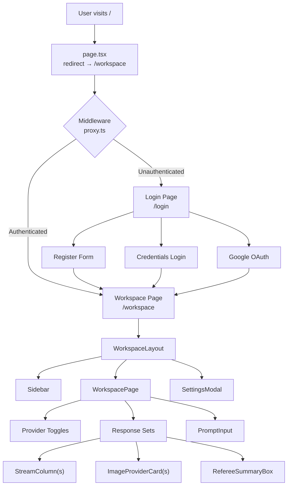
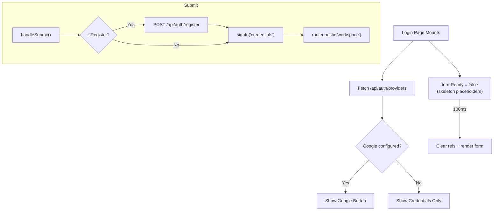
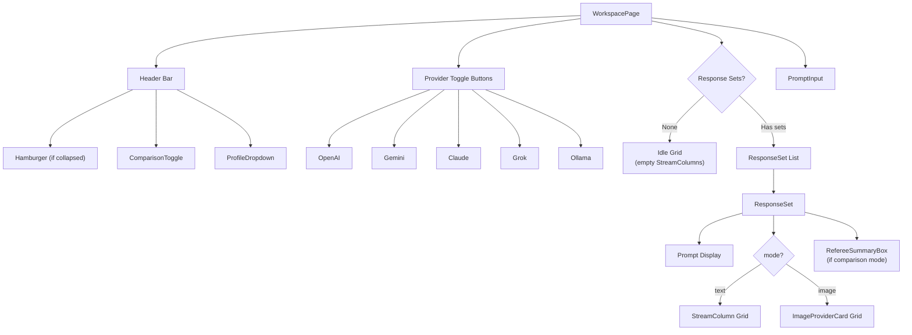
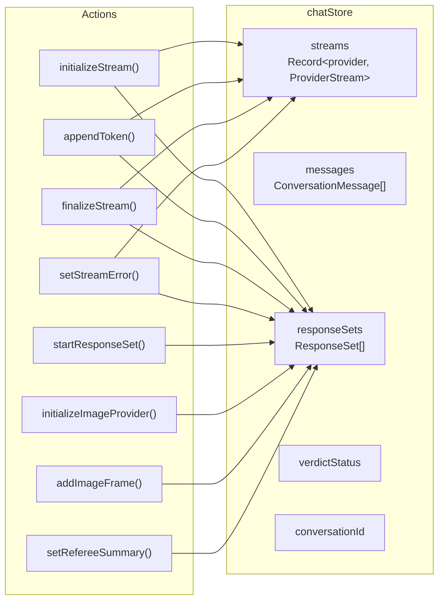
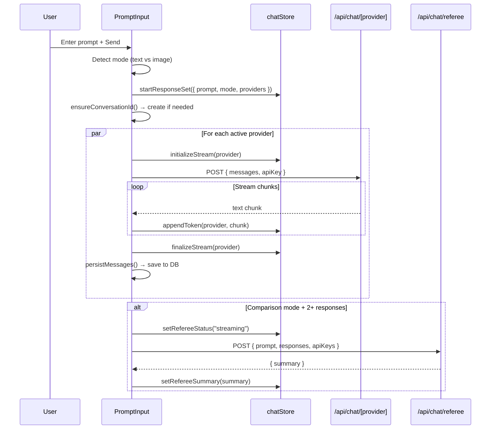
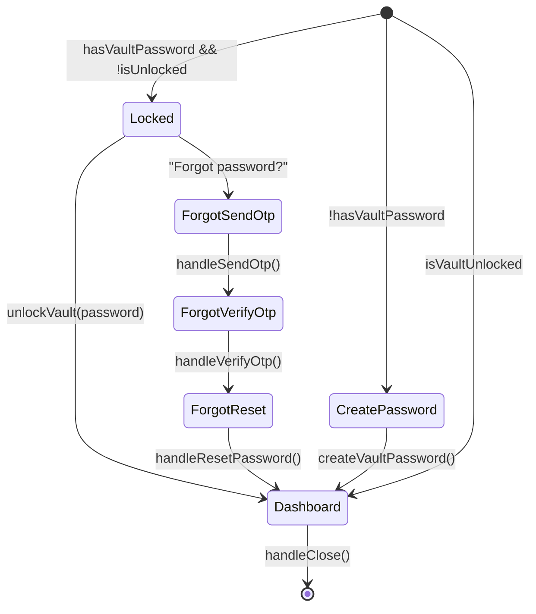

# Frontend Walkthrough — Plot

> **Framework:** Next.js 16 (App Router) · **State:** Zustand · **Styling:** Tailwind CSS 4 · **Auth Client:** NextAuth React

---

## Application Flow Overview



---

## Page Structure

### Root Layout (`app/layout.tsx`)

Wraps the entire application with:
- **`<Providers>`** — NextAuth `SessionProvider` for client-side session access
- Global CSS via `globals.css`
- SEO metadata: `"Plot — Parallel Multi-LLM Workspace"`

### Root Page (`app/page.tsx`)

Server-side redirect to `/workspace`. No UI rendered.

---

## Login Page (`app/login/page.tsx`)

A client component wrapped in `<Suspense>` for Next.js `useSearchParams()` compatibility.

### Features

| Feature | Implementation |
|---|---|
| **Credentials Auth** | Email/password form → `POST /api/auth/register` (if register mode) → `signIn("credentials")` |
| **Google OAuth** | Conditionally shown if `GET /api/auth/providers` returns `{ google: true }` |
| **Error Handling** | Reads `?error=` query param for OAuth callback errors with user-friendly messages |
| **Anti-autofill** | `autoComplete="off"`, ref-based clearing on mount, delayed form render |
| **Toggle Mode** | Switches between Sign In / Create Account with shared form |



---

## Workspace Layout (`app/workspace/layout.tsx`)

Renders the persistent workspace shell:
- **`<Sidebar />`** — Left panel: conversation history, search, new chat
- **`<main>`** — Children (workspace page content)
- **`<SettingsModal />`** — Overlay for API key management and vault operations

---

## Workspace Page (`app/workspace/page.tsx`)

The main workspace rendering engine. Manages provider toggles, response sets, and streaming columns.

### Component Hierarchy



### Dynamic Grid Layout

The grid adapts to the number of active providers:

| Providers | Grid Classes |
|---|---|
| 1 | `grid-cols-1 max-w-xl` |
| 2 | `grid-cols-1 md:grid-cols-2` |
| 3 | `grid-cols-1 md:grid-cols-3` |
| 4 | `grid-cols-1 md:grid-cols-2 xl:grid-cols-4` |
| 5 | `grid-cols-1 md:grid-cols-2 lg:grid-cols-3 xl:grid-cols-5` |

---

## State Management

### `chatStore` (Zustand)

Manages all streaming and conversation state.



**Key types:**

| Type | Purpose |
|---|---|
| `ProviderStream` | `{ isStreaming, currentText, error }` — live token state |
| `ConversationMessage` | Persisted message with `role`, `provider`, `batchId`, `refereeSummary` |
| `ResponseSet` | Groups all provider responses for one prompt: `responses`, `images`, `referee` state |
| `RefereeState` | `{ status, summary, error, provider }` — tracks referee analysis lifecycle |

**Selectors:** `selectStreamText(provider)`, `selectStreamStatus(provider)`, `selectStreamError(provider)` — fine-grained selectors to prevent unnecessary re-renders.

---

### `uiStore` (Zustand)

Manages application-wide UI state independently from chat data.

| State | Purpose |
|---|---|
| `sidebarCollapsed` | Toggle sidebar visibility |
| `activeProviders` | Which LLM providers are enabled (all 5 by default) |
| `settingsOpen` | Settings modal visibility |
| `unlockModalOpen` | Vault unlock modal visibility |
| `ollamaModalOpen` | Ollama setup modal visibility |
| `isVaultUnlocked` | Client-side vault lock state |
| `hasVaultPassword` | Whether vault was ever configured |
| `vaultEmail` | Email for password reset |
| `apiKeys` | In-memory API key cache (from localStorage) |
| `conversations` | Sidebar conversation list |
| `comparisonMode` | Referee/comparison toggle |

**Vault helpers:** `createVaultPassword()`, `unlockVault()` (SHA-256 hash comparison via Web Crypto API), `lockVault()`, `resetVaultPassword()`.

**Persistence:** API keys and vault hash stored in `localStorage` under `nexuschat_api_keys` and `nexuschat_vault_hash`.

---

## Component Deep Dive

### `PromptInput` — Multi-Provider Fan-Out Engine

The most complex component — orchestrates the entire prompt → stream → response lifecycle.



**Key functions:**

| Function | Purpose |
|---|---|
| `handleSend()` | Entry point — detects text vs image, creates response set |
| `handleTextPrompt()` | Fans out to all active providers concurrently |
| `handleImagePrompt()` | Streams NDJSON from `/api/generate-images`, parses events |
| `runRefereeSummary()` | Triggers referee after all streams complete (if comparison mode) |
| `ensureConversationId()` | Creates conversation on first prompt, reuses after |
| `persistMessages()` | Saves messages to DB via `/api/conversations/[id]/messages` |
| `looksLikeImagePrompt()` | Detects image intent via keywords ("draw", "generate image", etc.) |

---

### `StreamColumn` — Provider Response Card

Renders a single provider's response with live streaming support.

- **Dual data source:** Reads from chatStore selectors **or** explicit `textOverride`/`isStreamingOverride` props
- **Inline markdown rendering:** Parses `**bold**`, `` `code` ``, `# H1`, `## H2` into styled React elements
- **Auto-scroll:** Scrolls to bottom during streaming via `useEffect` on text changes
- **Streaming indicator:** Pulsing cursor block (`animate-pulse`) while `isStreaming` is true

---

### `Sidebar` — Conversation History

| Feature | Implementation |
|---|---|
| **Load conversations** | `GET /api/conversations` on mount + after actions |
| **New Chat** | Clears chatStore, resets conversationId |
| **Open conversation** | Fetches messages, rebuilds `ResponseSet[]` via `buildResponseSets()` |
| **Delete conversation** | `DELETE /api/conversations/[id]` with optimistic UI removal |
| **Clear all** | Confirmation modal → `DELETE /api/conversations` |
| **Search** | Client-side title filter |

**`buildResponseSets()`** — Reconstructs the ResponseSet data structure from flat message arrays. Groups messages by `batchId`, separates text/image modes, and reattaches referee summaries.

---

### `SettingsModal` — Vault & API Key Management

A multi-view modal that manages several workflows:



**Dashboard view:** Shows provider toggles (with Ollama setup gate) and API key input fields for each provider (OpenAI, Gemini, Claude, Grok). Keys are saved/deleted via uiStore.

---

### `VerdictCard` — Final Verdict Display

Renders the AI-generated comparison verdict in the workspace.

| Feature | Implementation |
|---|---|
| **Auto-trigger** | Fires when `comparisonMode` is on and all provider streams complete |
| **Provider selection** | Prefers gemini → openai → claude → grok (first with API key) |
| **Streaming display** | Reads from `streams["verdict"]` in chatStore |
| **Collapse** | Toggle to hide/show verdict body |
| **Regenerate** | Sets `verdictStatus` back to `"waiting"` to re-trigger |

---

### Other Components

| Component | Purpose |
|---|---|
| `ComparisonToggle` | Violet-themed toggle button for Referee mode in workspace header |
| `ProfileDropdown` | User avatar with dropdown: Switch Account, Logout |
| `UnlockModal` | Vault password entry → derives key server-side → injects fragment into JWT |
| `OllamaSetupModal` | Polls `localhost:11434/api/tags` every 3s to detect running Ollama, with HTTPS context warning |
| `Providers` | Thin wrapper around NextAuth `SessionProvider` |

---

## File Tree (Frontend)

```
src/
├── app/
│   ├── layout.tsx                 # Root layout + Providers + globals.css
│   ├── page.tsx                   # Redirect → /workspace
│   ├── globals.css                # Global styles
│   ├── login/
│   │   └── page.tsx               # Login / Register page
│   └── workspace/
│       ├── layout.tsx             # Sidebar + SettingsModal shell
│       └── page.tsx               # Main workspace (streaming grid)
├── components/
│   ├── Providers.tsx              # NextAuth SessionProvider wrapper
│   └── workspace/
│       ├── ComparisonToggle.tsx   # Referee mode toggle
│       ├── OllamaSetupModal.tsx   # Ollama connection wizard
│       ├── ProfileDropdown.tsx    # User avatar + menu
│       ├── PromptInput.tsx        # Multi-provider fan-out engine
│       ├── SettingsModal.tsx      # Vault + API key management
│       ├── Sidebar.tsx            # Conversation history
│       ├── StreamColumn.tsx       # Provider response card
│       ├── UnlockModal.tsx        # Vault unlock modal
│       └── VerdictCard.tsx        # AI comparison verdict
├── store/
│   ├── chatStore.ts               # Streaming + conversation state
│   └── uiStore.ts                 # UI state + vault + providers
└── proxy.ts                       # Auth middleware
```
